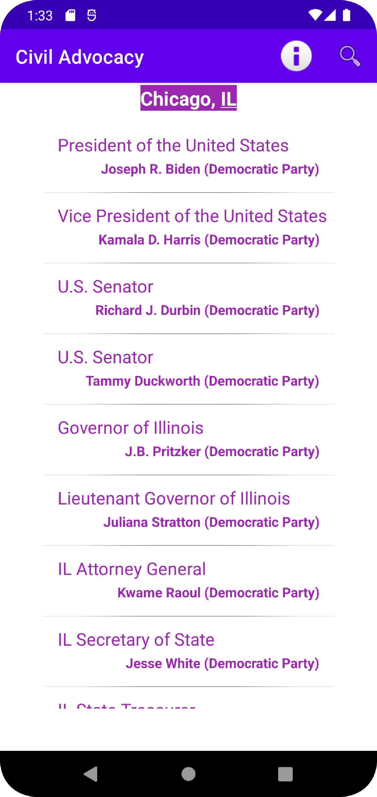

# Civil Advocacy

This app displays an interactive list of political officials that represent the current location (or a specified location) at each level of government. It utilizes the 
Google Civic Information API in order to acquire the government official data via REST service and JSON results. 

Clicking on a list entry opens up a more detailed page for that particular official. The contact information for that official as well as links for various social medial profiles
can then be accessed on this page. Not all officials will have all of the relevant information because all of the date relies on what the API provides. 

The app can be viewed in both portrait as well as landscape orientations. 

## Screenshots

   
